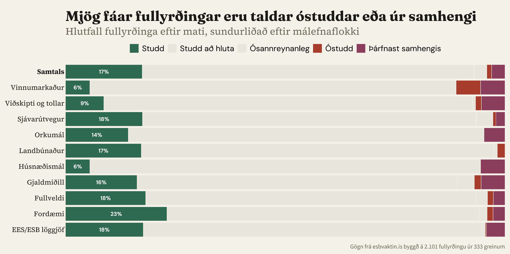
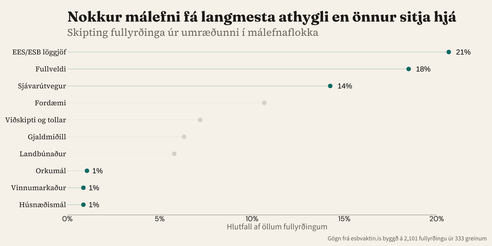

## {data-name="Upphaf" .center .centered-text}

::: {.hero-statement}
Spurningin 29. ágúst er hvort við eigum að **hefja viðræður** — ekki hvort við eigum að ganga í ESB.
:::

::: {.hero-follow}
En umræðan gerir nánast engan greinarmun á þessu tvennu.
:::

::: {.notes}
[0:15–0:35 · ~50 orð]

Spurningin 29. ágúst er hvort við eigum að hefja viðræður — ekki hvort við eigum að ganga í ESB. En umræðan gerir nánast engan greinarmun á þessu tvennu.

Við lögðum af stað til að kortleggja umræðuna kerfisbundið. Ekki til að svara spurningu pallborðsins — heldur til að sjá hvernig Ísland ræðir hana. Og kortið sýnir að samtalið er ekki þar sem maður myndi búast við.
:::

## {data-name="Aðferð"}

::: {.pipeline}

::: {.pipeline-step .fragment}
[333 greinar]{.pipeline-number}

[→ Fullyrðingagreining]{.pipeline-arrow}
:::

::: {.pipeline-step .fragment}
[2.101 fullyrðingar]{.pipeline-number}

[→ Mat á sannanir]{.pipeline-arrow}
:::

::: {.pipeline-step .fragment}
[499 heimildir]{.pipeline-number}

[handlesnar · lagatextar · Eurostat · sáttmálar]{.pipeline-detail}
:::

:::

::: {.key-line .fragment style="margin-top: 2rem;"}
Hvert skref er rekjanlegt. Heimildir → gögn → mat → þú getur athugað.
:::

::: {.notes}
[0:35–0:55 · ~60 orð · 3 smellir]

[Smellur 1: 333 greinar] Við lesum greinar og drögum út fullyrðingar.

[Smellur 2: 2.101 fullyrðingar] Þær eru bornar saman við heimildagrunn — lagatexta, Eurostat-gögn, sáttmálaákvæði, þingræður.

[Smellur 3: 499 heimildir] Hvert mat vísar til heimilda. Hver heimild vísar til frumheimildar.

[Smellur 4: Lykilsetning] Keðjan er rekjanleg frá upphafi til enda.
:::

## {data-name="Gæði"}

{width="100%"}

::: {.notes}
[0:55–1:15 · ~40 orð]

75 prósent fullyrðinga eru að hluta studdar — ekki rangar, en samhengið vantar. Minna en ein af fimmtíu er beinlínis röng. Vandamálið er ekki lygar — vandamálið er hálfur sannleikur. Og þetta á við beggja vegna.
:::

## {data-name="Tafla" .no-heading}

::: {.discourse-table}

<table>
<thead>
<tr>
  <th></th>
  <th>Hvað umræðan endurtekur</th>
  <th>Hvað enginn spyr</th>
</tr>
</thead>
<tbody>
<tr class="fragment">
  <td><strong>EES-réttur</strong></td>
  <td>Báðar hliðar vitna í „70%" — engin segir hvaða nefnara hún notar. Sömu gögnin, gagnstæð rök</td>
  <td>Geta 380 þúsund innleitt allt regluverkið? 400–500 tilskipanir bíða þegar</td>
</tr>
<tr class="fragment">
  <td><strong>Sjávarútvegur</strong></td>
  <td>14 af 20 fullyrðingum: hvað við myndum tapa. Engin: hvaða skilmála við gætum samið</td>
  <td>800–1.000 ma.kr. í kvótaeignum — ekki meðal topp 20</td>
</tr>
<tr class="fragment">
  <td><strong>Landbúnaður</strong></td>
  <td>6:1 framleiðendamiðað. Eitt blað ræður 36% umfjöllunar</td>
  <td>50–70% matvælaverðsálag (Eurostat). Kemur fyrir í 2 af 20</td>
</tr>
<tr class="fragment">
  <td><strong>Fullveldi</strong></td>
  <td>Mest endurtekið: dagsetning atkvæðagreiðslu (49×). Viðræður og aðild blandað saman</td>
  <td>Afturkræfni: 0 af 25. Dönskur varnarmálaundanþága (felld 2022): enn nefnd</td>
</tr>
</tbody>
</table>

:::

::: {.notes}
[1:15–2:15 · ~120 orð · 4 smellir, ~15s á röð]

[Smellur 1: EES-réttur] Mest endurtekna fullyrðingin: Ísland hafi innleitt 70 prósent af löggjöf ESB. Báðar hliðar nota hana. Engin segir hvaða nefnara. 13,4 prósent ef þú telur allt. 75 prósent ef þú telur aðeins innri markaðinn. Og enginn spyr hvort 380 þúsund geti innleitt allt regluverkið.

[Smellur 2: Sjávarútvegur] Fjórtán af tuttugu: hvað við myndum tapa. Engin: hvaða skilmála gætum við samið? Kvótinn — 800 til 1.000 milljarðar — ekki meðal topp tuttugu.

[Smellur 3: Landbúnaður] Sex á móti einu á hlið framleiðenda. Matvælaverð 50 til 70 prósent yfir meðaltali ESB — kemur fyrir í tveimur af tuttugu.

[Smellur 4: Fullveldi] Mest endurtekið: dagsetning atkvæðagreiðslunnar, 49 sinnum. Ferlið er afturkræft á öllum stigum — kemur hvergi fram í topp 25. Danska varnarmálaundanþágan, felld 2022, er enn nefnd eins og hún sé í gildi.
:::

## {data-name="Umræðan"}

{width="100%"}

::: {.notes}
[2:15–2:35 · ~50 orð]

Stærsta niðurstaðan. EES-réttur, fullveldi, sjávarútvegur — yfir helmingur samtalanna. Orkumál, vinnumarkaður, húsnæðismál — undir þrjú prósent samtals. Efnin sem skipta mestu máli í daglegu lífi eru efnin sem samtalið hefur ekki enn náð til. Samtalið hefur tíma — en aðeins ef við tökum eftir eyðunni.
:::

## {data-name="Lokaorð" .center .centered-text}

::: {.three-questions}

::: {.fragment .fade-in}
[1. Er ég forvitinn — eða er ég að verja afstöðu?]{.question}
[— Tim Harford]{.attribution}
:::

::: {.fragment .fade-in}
[2. Er þetta sett fram til að upplýsa mig — eða til að sannfæra mig?]{.question}
[— David Spiegelhalter]{.attribution}
:::

::: {.fragment .fade-in}
[3. Get ég athugað þetta sjálfur?]{.question}
[— Onora O'Neill]{.attribution}
:::

:::

::: {.closing-question .fragment .fade-in}
Hvaða spurningum getum við svarað — og hvaða spurningar snúast í raun um val, ekki vitneskju?
:::

::: {.notes}
[2:35–3:00 · ~60 orð · 4 smellir]

Þegar þið lesið um þjóðaratkvæðagreiðsluna héðan til ágúst, þrjár spurningar munu nýtast vel.

[Smellur 1] Frá Tim Harford: Er ég forvitinn — eða er ég að verja afstöðu?

[Smellur 2] Frá David Spiegelhalter: Er þessu sett fram til að upplýsa — eða sannfæra?

[Smellur 3] Frá Onora O'Neill: Get ég athugað þetta sjálfur?

[Smellur 4 — hljótt] Hvaða spurningum getum við svarað — og hvaða spurningar snúast um val, ekki vitneskju?

[Þögn. Takk.]
:::
