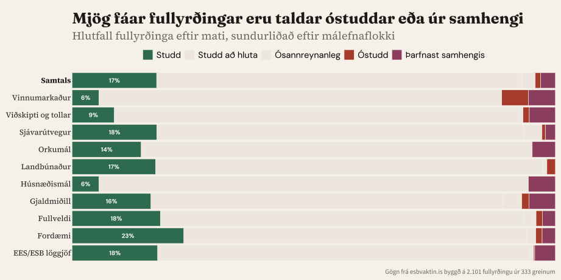
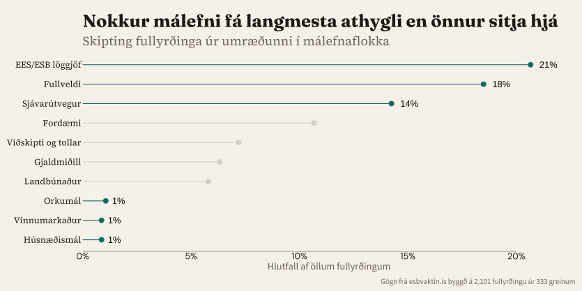

## {data-name="Upphaf" .center .centered-text}

::: {.hero-statement}
Spurningin 29. ágúst er hvort við eigum að **hefja viðræður** — ekki hvort við eigum að ganga í ESB.
:::

::: {.hero-follow}
En umræðan gerir nánast engan greinarmun á þessu tvennu.
:::

„Þjóðaratkvæðagreiðslan er um <strong>aðild</strong> Íslands að Evrópusambandinu"

„Hvað gerist ef kosið verður að halda áfram <strong>viðræðum</strong>?"

„Vilja leiða þjóðina blinda til Brussel"

„Vafasöm spurning um ESB-<strong>viðræður</strong>"

„Segir Ísland tipla inn í ESB án umræðu"

Allar úr sama gagnagrunninum. Sama frétt — önnur spurning.

::: {.notes}
[0:15–0:35 · ~50 orð · 2 smellir]

Spurningin 29. ágúst er hvort við eigum að hefja viðræður — ekki hvort við eigum að ganga í ESB. En umræðan gerir nánast engan greinarmun á þessu tvennu.

[Smellur 1: Fyrirsagnir] Þetta eru raunverulegar fyrirsagnir úr gagnagrunninum okkar. Sumar segja „viðræður." Aðrar segja „aðild." Sama frétt — önnur spurning.

[Smellur 2: Athugasemd] Við lögðum af stað til að kortleggja þetta kerfisbundið.
:::

## {data-name="Aðferð" .no-heading}

  1
  Umræða
  Greinar, ræður og viðtöl skoðuð
  333 greinar

→

  2
  Fullyrðingar
  Mælanlegar staðhæfingar dregnar út
  2.101 skráðar

→

  3
  Heimildir
  Bornar saman við gögn og lagaákvæði
  499 heimildir

→

  4
  Mat
  Fullyrðingar flokkaðar eftir gæðum
  ● ● ● ● ●

Grein<em>„Við höfum ekki tekið upp 80% af reglum ESB"</em>Stjórnmálin · 24. mars→Fullyrðing„Ísland hafi innleitt 80% af regluverki ESB"→HeimildirEEA-LEGAL-001 · EEA-DATA-017→þarfnast samhengis

::: {.notes}
[0:35–0:55 · ~60 orð · 5 smellir]

[Smellur 1: Umræða] Við lesum greinar, þingræður, viðtöl — 333 texta hingað til.

[Smellur 2: Fullyrðingar] Við drögum út staðhæfingar sem hægt er að bera saman við gögn. Rúmlega tvö þúsund.

[Smellur 3: Heimildir] Þær eru bornar saman við heimildagrunn — lagatexta, Eurostat-gögn, sáttmálaákvæði, þingræður. 499 heimildir.

[Smellur 4: Mat] Útkoman: flokkun eftir gæðum. Fimm flokkar — frá „stutt" til „villandi."

[Smellur 5: Dæmi] Hér er raunverulegt dæmi. Grein á Stjórnmálin.is rannsakaði sjálf þessa tölu. Utanríkisráðherra sagði 80 prósent — en heimild EEA-LEGAL-001 segir 70 prósent af innri markaðinum, og EEA-DATA-017 segir 13 prósent ef allt er talið. Mat: þarfnast samhengis — talan fer eftir nefnaranum.
:::

## {data-name="Gæði"}

{width="100%"}

::: {.notes}
[0:55–1:15 · ~40 orð]

75 prósent fullyrðinga eru að hluta studdar — ekki rangar, en samhengið vantar. Minna en ein af fimmtíu er beinlínis röng. Vandamálið er ekki lygar — vandamálið er hálfur sannleikur. Og þetta á við beggja vegna.
:::

## {data-name="Tafla" .no-heading}

::: {.discourse-table}

<table>
<thead>
<tr>
  <th></th>
  <th>Hvað umræðan endurtekur</th>
  <th>Hvað enginn spyr</th>
</tr>
</thead>
<tbody>
<tr class="fragment">
  <td>
    EES-réttur424 fullyrðingar
  </td>
  <td>
    Báðar hliðar vitna í „70%" — engin segir nefnarann. Bilið er
    5×
  </td>
  <td>400–500 tilskipanir bíða þegar — geta 380 þúsund tekið á sig allt?</td>
</tr>
<tr class="fragment">
  <td>
    Sjávarútvegur291 fullyrðing
  </td>
  <td>
    14 af 20: hverju við myndum tapa.
    Engin: hvaða skilmála við gætum samið
  </td>
  <td>800–1.000 ma.kr. í kvótaeignum — ekki meðal topp 20</td>
</tr>
<tr class="fragment">
  <td>
    Landbúnaður146 fullyrðingar
  </td>
  <td>
    6:1 á hlið framleiðenda. Eitt blað ræður
    36% umfjöllunar
  </td>
  <td>
    50–70% matvælaverðsálag — kemur fyrir í 2 af 20
  </td>
</tr>
<tr class="fragment">
  <td>
    Fullveldi383 fullyrðingar
  </td>
  <td>
    Mest endurtekið: dagsetning (49×). Viðræðum og
    aðild blandað saman
  </td>
  <td>
    Afturkræfni: 0 af 25. Dönsk undanþága felld
    2022 — enn nefnd
  </td>
</tr>
</tbody>
</table>

:::

::: {.notes}
[1:15–2:15 · ~150 orð · 4 smellir, ~15s á röð]

[Smellur 1: EES-réttur] 424 fullyrðingar, stærsta undirefnið. Mest endurtekna: Ísland hafi innleitt 70 prósent. Báðar hliðar nota hana — engin segir hvaða nefnara. Bilið er fimmfalt: 13,4 prósent ef allt er talið, 75 ef aðeins innri markaðurinn. 77 prósent þarfnast samhengis. Og enginn spyr hvort 380 þúsund geti innleitt allt regluverkið.

[Smellur 2: Sjávarútvegur] Fjórtán af tuttugu efstu fullyrðingunum snúast um það sem við myndum tapa. Fjórar um hvað við gætum lært. Engin spyr: hvaða skilmála gæti Ísland samið um? Sjávarútvegskaflinn var aldrei opnaður í viðræðunum 2010 til 2013. Kvótinn — 800 til 1.000 milljarðar — ekki meðal topp tuttugu.

[Smellur 3: Landbúnaður] Sex á móti einu á hlið framleiðenda. Neytandinn er stærsti blindi bletturinn — matvælaverð 50 til 70 prósent yfir meðaltali. Kemur fyrir í tveimur af tuttugu.

[Smellur 4: Fullveldi] Stærsta málefnið. Mest endurtekið: dagsetning atkvæðagreiðslunnar, 49 sinnum. Afturkræfni — tryggð í sáttmálanum — kemur hvergi fram í topp 25.
:::

## {data-name="Umræðan"}

{width="100%"}

::: {.notes}
[2:15–2:35 · ~50 orð]

Stærsta niðurstaðan. EES-réttur, fullveldi, sjávarútvegur — yfir helmingur samtalanna. Orkumál, vinnumarkaður, húsnæðismál — undir þrjú prósent samtals. Efnin sem skipta mestu máli í daglegu lífi eru efnin sem samtalið hefur ekki enn náð til. Samtalið hefur tíma — en aðeins ef við tökum eftir eyðunni.
:::

## {data-name="Lokaorð" .center .centered-text}

::: {.three-questions}

::: {.fragment .fade-in}
[1. Er ég forvitinn — eða er ég að verja afstöðu?]{.question}
[— Tim Harford]{.attribution}
:::

::: {.fragment .fade-in}
[2. Er þetta sett fram til að upplýsa mig — eða til að sannfæra mig?]{.question}
[— David Spiegelhalter]{.attribution}
:::

::: {.fragment .fade-in}
[3. Get ég athugað þetta sjálfur?]{.question}
[— Onora O'Neill]{.attribution}
:::

:::

::: {.closing-question .fragment .fade-in}
Hvaða spurningum getum við svarað — og hvaða spurningar snúast í raun um val, ekki vitneskju?
:::

::: {.notes}
[2:35–3:00 · ~60 orð · 4 smellir]

Þegar þið lesið um þjóðaratkvæðagreiðsluna héðan til ágúst, þrjár spurningar munu nýtast vel.

[Smellur 1] Frá Tim Harford: Er ég forvitinn — eða er ég að verja afstöðu?

[Smellur 2] Frá David Spiegelhalter: Er þetta sett fram til að upplýsa — eða sannfæra?

[Smellur 3] Frá Onora O'Neill: Get ég athugað þetta sjálfur?

[Smellur 4 — hljótt] Hvaða spurningum getum við svarað — og hvaða spurningar snúast um val, ekki vitneskju?

[Þögn. Takk.]
:::
