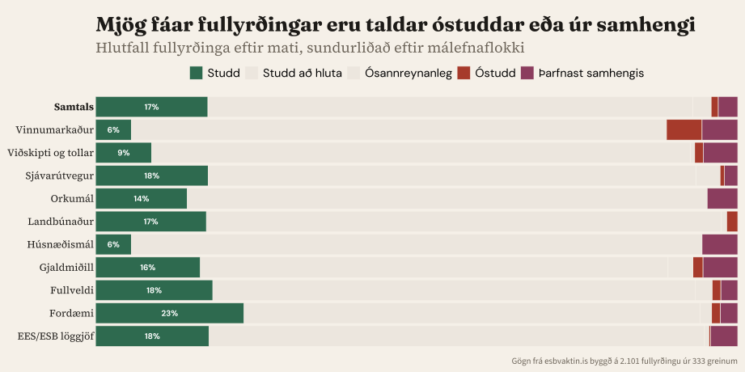
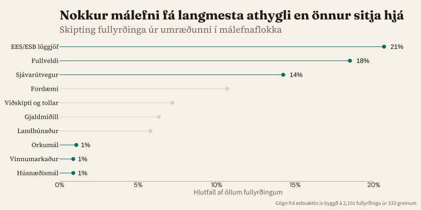

## {data-name="Upphaf" .center .centered-text}

::: {.hero-statement}
Spurningin er um **viðræður**, en umræðan er oft um **aðild**.
:::

::: {.hero-follow}
Umræðan gerir lítinn greinarmun á þessu tvennu.
:::

Vísir<time>31. mars</time>

„Hvað kostar möguleg <strong>aðild</strong> Íslands að Evrópusambandinu?"

Vísir<time>10. mars</time>

„Hvað gerist ef kosið verður að halda áfram <strong>viðræðum</strong>?"

RÚV<time>7. mars</time>

„ESB <strong>aðild</strong> hefði veruleg neikvæð áhrif á bænda"

Morgunblaðið<time>9. mars</time>

„Segja '<strong>samningaviðræður</strong>' vera villandi hugtak"

DV<time>21. mars</time>

„Svona eykst sjálfstæði Íslands með ESB-<strong>aðild</strong>"

Allar úr gagnagrunni ESB Vaktarinnar

## {data-name="Aðferð" .no-heading}

  1
  Umræða
  Greinar, ræður og viðtöl skoðuð
  343 greinar

→

  2
  Fullyrðingar
  Mælanlegar staðhæfingar dregnar út
  2.154 skráðar

→

  3
  Heimildir
  Bornar saman við gögn og lagaákvæði
  499 heimildir

→

  4
  Mat
  Fullyrðingar flokkaðar eftir gæðum
  ● ● ● ● ●

Grein<em>„Líklega er hlutfallið komið eitthvað nær 20% í dag en hins vegar óraveg frá 75-80%."</em>Stjórnmálin · 24. mars→Fullyrðing„Ísland hafi innleitt 80% af regluverki ESB"→HeimildirEEA-LEGAL-001 · EEA-DATA-017 · EEA-LEGAL-006→að hluta staðfest

## {data-name="Gæði"}

{width="100%"}

## {data-name="Umræðan"}

{width="100%"}

## {data-name="Niðurstaða" .center .centered-text}

::: {.hero-statement}
Stærsta tækifærið er að greina hvað við vitum, hvað við þurfum að læra, og hvað við getum ekki vitað.
:::

::: {.hero-follow .fragment .fade-in}
Stærsta áskorunin er að þetta er samvinnuverkefni — bæði þeirra sem skrifa og þeirra sem lesa.
:::

::: {.closing-question .fragment .fade-in}
Hvaða spurningum getum við **svarað núna**? Hvaða spurningar þurfa **meiri upplýsingar**? Hvaða spurningum er **ekki hægt að svara**?
:::

## {data-name="Lokaorð" .center .centered-text}

::: {.three-questions}

::: {.fragment .fade-in}
[1. Er ég forvitin — eða er ég að verja afstöðu?]{.question}
[— Tim Harford]{.attribution}
:::

::: {.fragment .fade-in}
[2. Er þetta sett fram til að upplýsa mig — eða til að sannfæra mig?]{.question}
[— David Spiegelhalter]{.attribution}
:::

::: {.fragment .fade-in}
[3. Reyndu ekki að auka traust, sýndu traustverðugleika.]{.question}
[— Onora O'Neill]{.attribution}
:::

:::
